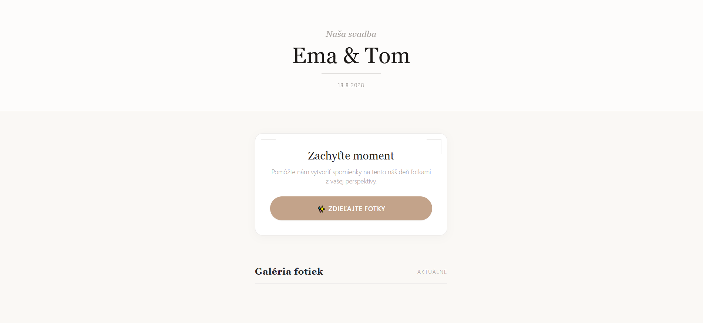
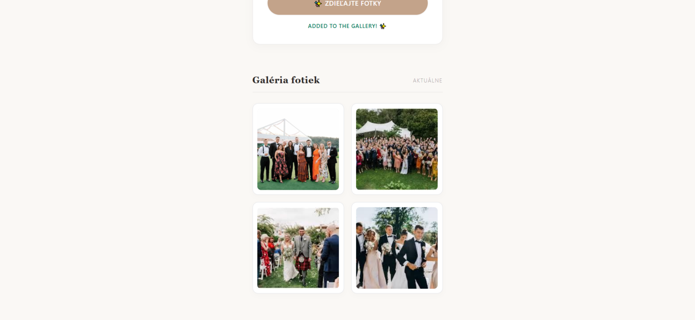

# Elegant Wedding Photo Share (Self-Hosted)

A lightweight, frictionless, and self-hosted web application for collecting wedding guest photos in real time. Guests scan a QR code, open their mobile camera directly in the browser, and upload images straight to your server. 

The system automatically handles mobile EXIF orientation, compresses photos on-the-fly to save disk space, and displays them in a clean, masonry-style live gallery.

---

<p align="center">
  
  
</p>

---

## Key Features

- **Frictionless UX:** Zero-install web app. HTML5 camera constraints trigger the native phone camera instantly.
- **On-the-Fly Compression:** Leverages the `sharp` library to automatically rotate images (using EXIF metadata), scale them down to max 1920px, and compress them into web-optimized JPEGs (~300KB - 500KB instead of 10MB+).
- **SQLite Database:** Zero configuration required. All metadata is tracked in a single-file database.
- **Chic Typography & UI:** Styled with a minimal botanical theme using Tailwind CSS and elegant Google Fonts (Cormorant Garamond & Montserrat).
- **Tunnel-Ready & Secure:** Works seamlessly over Cloudflare Tunnels to provide a secure HTTPS connection (mandatory for mobile browser camera access) without port-forwarding.

---

## Project Architecture & Tech Stack

```text
[Guest Mobile Browser] 
       │
       ▼ (HTTPS Upload via Tunnel)
   [Nginx Proxy]
       │
       ▼ (Local Port 3000)
 [Express.js Backend] ──> [Sharp Image Compression] ──> [Local SSD (uploads/)]
       │
       └───> [SQLite Database (wedding.db)]

```
## Manual to start

### Step 1: Start Nginx (Web Server)

Open your first **Command Prompt** and run:

```cmd
cd E:\nginx-1.30.2
start nginx
```

### Step 2: Start Node.js (Backend Application)
Open new **Command Prompt** , navigate to your app directory and start the Node.js server:

```cmd
cd E:\wedding-photo-share
node server.js
```

### Step 3: Start the Cloudflare Tunnel (Online Connection)
Open a new **Command Prompt** window. This tunnel must remain open and running for the entire duration of the wedding:

```cmd
cd E:\
cloudflared tunnel --url http://localhost:80
```

